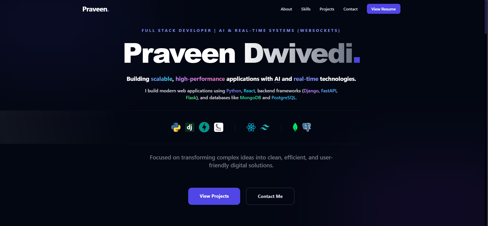

# Modern Portfolio - Praveen Dwivedi



A premium, high-performance portfolio website built with React, Vite, and Tailwind CSS. Featuring glassmorphism design, real-time contact updates via EmailJS, and a smooth, responsive user interface.

## 🚀 Features
- **Modern UI/UX**: Clean glassmorphism design with mesh gradients and glow effects.
- **Responsive**: Optimized for all screen sizes (Mobile, Tablet, Desktop).
- **Contact Form**: Direct email notifications using **EmailJS** (No backend required).
- **Smooth Animations**: Tailored reveal animations for a premium feel.
- **Tech Highlights**: Interactive skill bar and horizontal education summary.

## 🛠️ Tech Stack
- **Frontend**: React.js, Tailwind CSS
- **Tools**: Vite, Iconify API
- **Communication**: EmailJS

## 📦 Getting Started

### 1. Prerequisites
- Node.js (v18 or higher)
- npm or yarn

### 2. Installation
```bash
git clone https://github.com/Praveen869/portfolio.git
cd portfolio
npm install
```

### 3. Setup Environment Variables
Create a `.env` file in the root directory and add your EmailJS keys:
```bash
cp .env.example .env
```
Then edit `.env` with your actual credentials:
- `VITE_EMAILJS_SERVICE_ID`
- `VITE_EMAILJS_TEMPLATE_ID`
- `VITE_EMAILJS_PUBLIC_KEY`

### 4. Running Locally
```bash
npm run dev
```

## 🌐 Deployment

### Deploying to Vercel (Recommended)
1. Push your code to GitHub.
2. Import the project in Vercel.
3. **Important**: Add your environment variables in the Vercel dashboard settings.

### Deploying to GitHub Pages
1. Ensure `base: './'` is set in `vite.config.js`.
2. Run `npm run build`.
3. Deploy the `dist` folder.

---
Built with ❤️ by [Praveen Dwivedi](https://github.com/Praveen869)
